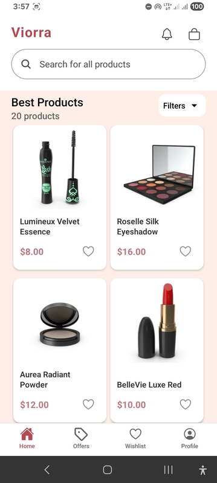
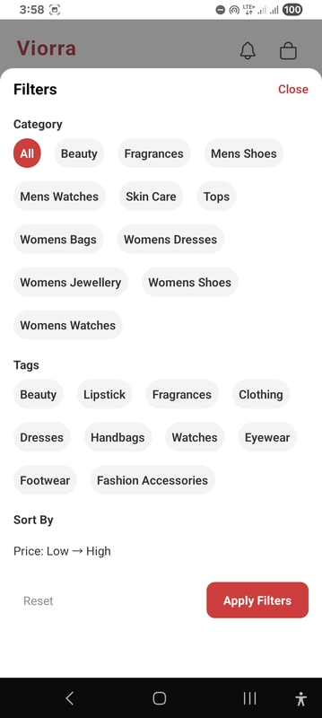
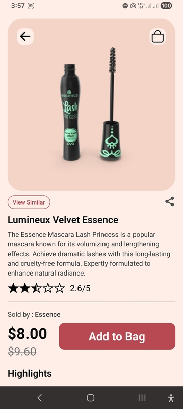
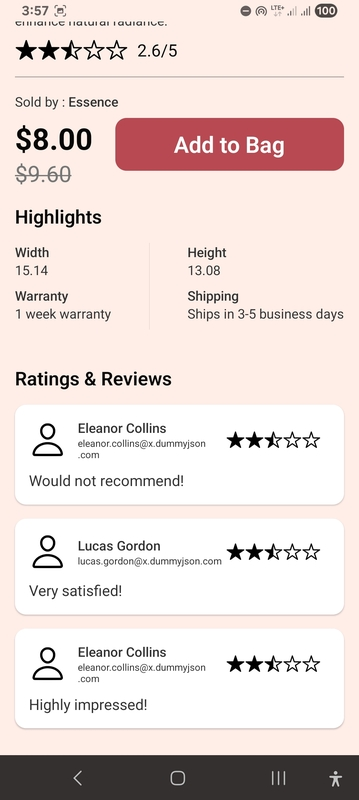
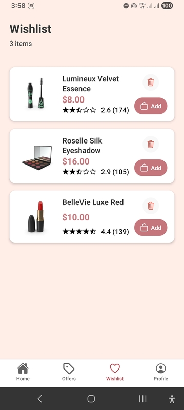
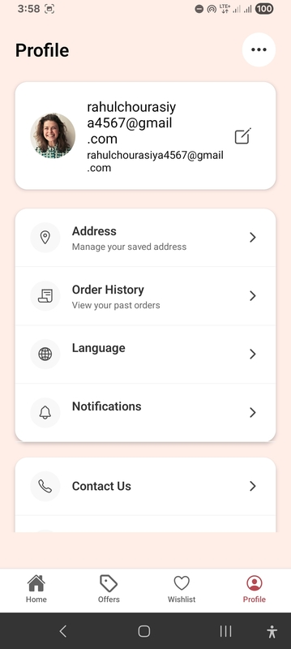

# GlowCart 🛍️

A sample e-commerce mobile app built with React Native CLI.  
Features include onboarding, authentication (mock), product listing, product details, and profile management.

---

## Demo

🎥 **Video Demonstration**  
[Watch the demo on Google Drive](https://drive.google.com/file/d/1wMiDRQMu2qyJ85vHDfkiMOJ5tuRIGUoE/view)

📱 **APK File**  
The latest build APK is available inside the repository under [`/assets`](./assets/glowcart.apk).  
You can download it directly from GitHub or transfer it to an Android device to install.

---

## Screenshots

_On-device screenshots (stored in `assets/`):_

### Onboarding / Get Started


### Login


### Home / Product List



### Filter Modal



### Product Details




### Wishlist / Profile




---

## 🚀 Setup Instructions

### Prerequisites

- Node.js (LTS recommended)
- React Native CLI
- Android Studio (or Xcode on macOS) for emulators
- Yarn or npm
- Git

### Install & Run

```bash
# clone repo (if not already)
git clone https://github.com/Rcmade/GlowCart.git
cd GlowCart

# install dependencies
npm install
# or
# yarn install

# Android
npx react-native run-android

# iOS (macOS only)
cd ios && pod install && cd ..
npx react-native run-ios
```

If you use a specific `.env` set up, add instructions here (none included in this repo by default).

---

## ⚙️ Project Structure (high level)

```js
src/
├─ App.tsx
├─ navigation/
│  ├─ AppNavigator.tsx
│  └─ TabNavigator.tsx
├─ lib/
│  ├─ api.ts                # axios instance + interceptors
│  └─ asyncStorage.ts       # typed AsyncStorage helpers
├─ providers/
│  └─ QueryProvider.tsx     # react-query provider wrapper
├─ features/
│  ├─ auth/
│  │  ├─ hooks/
│  │  │  ├─ useLogin.ts
│  │  │  └─ useRegister.ts
│  │  └─ api.ts
│  └─ products/
│     ├─ hooks/
│     │  ├─ useProducts.ts
│     │  └─ useProductDetails.ts
│     ├─ api.ts
│     └─ components/
│        └─ cards/ProductCard.tsx
├─ screens/
│  ├─ OnboardingScreen.tsx
│  ├─ LoginScreen.tsx
│  ├─ RegisterScreen.tsx
│  ├─ HomeScreen.tsx
│  └─ ProductDetailsScreen.tsx
└─ assets/
   └─ screenshots/          # README images you already have

assets/              # screenshots used in README
```

---

## 📌 Assumptions & Known Issues

- Authentication is mocked via AsyncStorage (no real backend auth or secure tokens).
- Products are fetched from DummyJSON and mapped to a cosmetic product shape for UI consistency.
- Cart/checkout flow not implemented in this version.
- Tested primarily on Android emulator (mention concrete device/emulator details if relevant).
<!-- - Video demo to be added later. -->
